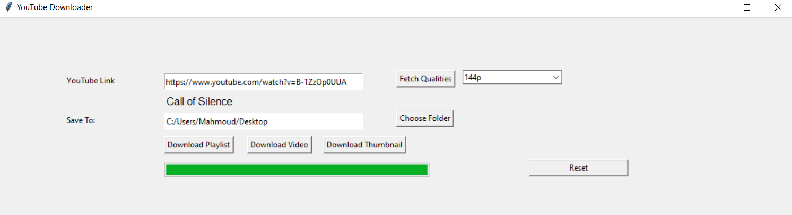

# YouTube Downloader

Easily download YouTube videos, playlists, and thumbnails right from your desktop. Powered by Python and a user-friendly GUI, make content offline and watch it anytime!
## App Preview 🖼

## Features 🌟
- **Single Video Downloads** 🎥: Just paste the video URL and get the video in your desired quality.
  
- **Playlist Downloads** 📂: Got an entire playlist to download? No problem! Just paste the link, and let the app do the rest.

- **Thumbnail Downloads** 🖼️: Want to save a video thumbnail? We've got you covered.
  
- **Quality Choices** 🎛️: Choose from a variety of available qualities for each video.
  
- **Progress Tracking** 📊: Visual progress bars let you know how your downloads are progressing.

## How to Use

1. **Enter the URL**: Copy and paste the YouTube video or playlist URL into the input box.
2. **Choose the Folder**: Decide where you want your content to be saved.
3. **Select Quality**: For videos, select the desired quality from the dropdown.
4. **Download**: Click on the relevant download button based on what you want (video, playlist, or thumbnail).

## Technical Details 🛠️

- **Languages/Frameworks**: Built with Python, leveraging the tkinter library for GUI.
- **YouTube Interaction**: Uses the `pytube` library to fetch video streams and details.
- **Error Handling**: The app retries failed downloads and informs the user if a video cannot be accessed.
- **Modular Codebase**: The code is structured around the SOLID principles, ensuring robustness and maintainability.
## Understanding Streams 🌊
YouTube primarily offers two types of streams: Progressive and DASH.

- Progressive Streams: These streams combine audio and video into one file. They're straightforward but have quality constraints.
- DASH (Dynamic Adaptive Streaming over HTTP) Streams: Here, audio and video are split. DASH offers more versatility and facilitates higher video qualities but necessitates post-download merging.

How Our Downloader Operates:
1. Fetching: The downloader discerns available DASH and Progressive streams from the input link.
2. Quality Selection:
    - For 720p and 1080p videos, the top-tier audio quality is fetched.
    - For other resolutions, a mid-tier audio quality is preferred to balance clarity and file size.
3. Downloading: DASH streams are retrieved concurrently, expediting the download phase.
4. Merging with FFmpeg: After downloading, DASH streams are merged using the FFmpeg software, guaranteeing seamless playback.

By employing FFmpeg and comprehending YouTube's streaming methodology, our downloader ensures efficient and premium-grade content downloads.

## Contribution Opportunities 🛠️
I'm looking to make the YouTube Downloader even better and would love your help! Here are some features I'm considering:

- **MP3 Downloads**: Enhance the downloader to allow users to save videos as MP3, perfect for music and podcasts.

- **Modern GUI Design**: If you're a design enthusiast, help me modernize our GUI for a better user experience.

- **History Recording**: Implement a feature that lets users view their download history.
... and more! If you have a feature in mind, feel free to discuss it!

## How to Contribute 🤝
1. Fork the Repository: Start by forking this repository to your GitHub account.

2. Clone & Create a Branch: Clone the repository to your local machine and create a new branch for your feature or fix.

3. Implement & Test: Make your changes, ensuring you provide test coverage.

4. Submit a Pull Request: Push your branch to your fork and submit a pull request to the main repository. We'll review it soon!

## Feedback & Issues 📢
Found a bug 🐞? Want a new feature 🎁? Feel free to open an issue or drop feedback.